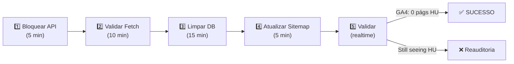

# 🗺️ Fluxo Visual: Como as Strings Húngaras Apareceram

## Diagrama de Fluxo do Problema

```
┌─────────────────────────────────────────────────────────────────────┐
│                         ORIGEM DO PROBLEMA                           │
└─────────────────────────────────────────────────────────────────────┘

1. ADMIN ACESSA ROTA DE TRADUÇÃO
   ├─ POST /api/admin/blog/translate
   ├─ Body: {
   │    post_id: "abc123",
   │    target_lang: "hu"  ← ❌ NENHUMA VALIDAÇÃO!
   │  }

2. API ACEITA E TRADUZ
   ├─ Busca post em blog_posts
   ├─ Chama OpenAI para traduzir para húngaro
   ├─ Gera slug: "guia-tutor-spitz-alemao-anao-hu"
   ├─ Salva em blog_post_localizations:
   │  {
   │    post_id: "abc123",
   │    lang: "hu",
   │    slug: "guia-tutor-spitz-alemao-anao-hu",
   │    title: "Pomerániai (német törpe spicc)",  ← HÚNGARO!
   │    content_mdx: "# Pomerániai..."            ← HÚNGARO!
   │  }

3. GA4 / GOOGLE VÊEM PÁGINA
   ├─ User tenta acessar: /blog/guia-tutor-spitz-alemao-anao-hu
   ├─ Next.js chama api/blog/[slug]/page.tsx
   ├─ fetchPost() busca APENAS em blog_posts
   ├─ Não encontra em blog_posts.slug ❌
   ├─ Retorna null
   ├─ notFound() → 404 PAGE
   ├─ Mas já foi rastreado por:
   │  ├─ GoogleBot (crawl)
   │  ├─ GA4 (pageview)
   │  ├─ Facebook Pixel (track)

4. RESULTADO FINAL
   └─ GA4 mostra páginas "Pomerániai (német törpe spicc)"
      Google Search Console marca 404
      Traffic perdido / Spam de analytics


┌─────────────────────────────────────────────────────────────────────┐
│                    ARQUITETURA ATUAL (QUEBRADA)                      │
└─────────────────────────────────────────────────────────────────────┘


                        USUARIO FINAL
                             │
                             ▼
                    /blog/guia-tutor-spitz-alemao-anao-hu
                             │
                             ▼
              ┌───────────────────────────────┐
              │  app/blog/[slug]/page.tsx      │
              │  fetchPost(slug)              │
              └───────────────┬───────────────┘
                              │
                    Busca apenas em:
                              │
              ┌───────────────┴───────────────┐
              │   blog_posts.slug             │
              │   (INCOMPLETO!)               │
              └───────────┬───────────────────┘
                          │
           ┌──────────────┴──────────────┐
           │                             │
    Encontra "guia-tutor-spitz"   ❌ NÃO ENCONTRA
    (post principal)              "guia-tutor-spitz-alemao-anao-hu"
           │                             │
           ▼                             ▼
       RENDERIZA              blog_post_localizations
       POST PT-BR             ├─ post_id: abc123
                              ├─ lang: "hu"
                              ├─ slug: "guia-tutor-spitz-alemao-anao-hu"
                              ├─ title: "Pomerániai..."
                              └─ content_mdx: "# Pomerániai..."
                                             │
                                             ▼
                                        IGNORADO!
                                        Retorna 404

┌─────────────────────────────────────────────────────────────────────┐
│                       SOLUÇÃO APLICADA                               │
└─────────────────────────────────────────────────────────────────────┘

FASE 1: Bloquear Criação
═══════════════════════
  POST /api/admin/blog/translate
          │
          ├─ VALIDAÇÃO NOVA:
          │  └─ if (!["pt-BR", "en-US"].includes(target_lang))
          │     return 403 "Idioma não suportado"
          │
          └─ ✅ RESULTADO: Nunca mais cria posts -hu, -es, -de


FASE 2: Bloquear Acesso
════════════════════════
  app/blog/[slug]/page.tsx
          │
          ├─ VALIDAÇÃO NOVA:
          │  └─ if (slug.match(/-hu$/) && !PREVIEW)
          │     return null (404)
          │
          └─ ✅ RESULTADO: Mesmo que -hu exista no DB, retorna 404


FASE 3: Limpeza
═════════════════
  DELETE FROM blog_post_localizations
  WHERE lang NOT IN ('pt-BR', 'en-US')
          │
          └─ ✅ RESULTADO: Remove dados húngaros do DB


FASE 4: SEO Protection
═══════════════════════
  sitemap.ts: Não inclui -hu URLs
  robots.txt: Disallow /*-hu*
  headers:    X-Robots-Tag: noindex para -hu
          │
          └─ ✅ RESULTADO: Google não rastreia mais
```

## Matriz de Decisão

| Opção | Implementação | Tempo | Recorrência | Recomendado |
|-------|---------------|-------|-------------|------------|
| **A - Bloquear** | Restringir API, validar em fetchPost | 30 min | ✅ Permanente | ✅ SIM |
| **B - i18n Completo** | next-intl, middleware, routing | 3 horas | ⚠️ Complexo | ❌ NÃO |
| **C - Nada fazer** | Ignorar | 0 min | 📈 Piora | ❌ Nunca |

---

## 5 Passos Resumidos



---

## Checklist Visual

```
┌─ [x] Identificar origem: /api/admin/blog/translate
├─ [x] Encontrar dados: blog_post_localizations com lang='hu'
├─ [x] Criar plano: 5 fases (Bloqueio → Limpeza → SEO)
│
├─ [ ] FASE 1: Adicionar whitelist em translate/route.ts
├─ [ ] FASE 2: Validar slug em blog/[slug]/page.tsx  
├─ [ ] FASE 3: Executar DELETE na database
├─ [ ] FASE 4: Atualizar sitemap.ts
├─ [ ] FASE 5: Atualizar robots.ts
│
├─ [ ] Teste: Tentar acessar /blog/...-hu → 404
├─ [ ] Teste: POST com lang=hu → 403
├─ [ ] Verificar GA4: 0 páginas em húngaro
└─ [ ] Google Search Console: Remover URLs -hu descobertas
```
